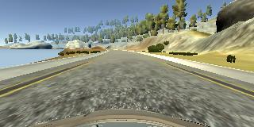

#**Behavioral Cloning** 

## Writeup Template


**Behavioral Cloning Project**

The goals / steps of this project are the following:
* Use the simulator to collect data of good driving behavior
* Build, a convolution neural network in Keras that predicts steering angles from images
* Train and validate the model with a training and validation set
* Test that the model successfully drives around track one without leaving the road
* Summarize the results with a written report


[//]: # (Image References)

[image1]: ./examples/placeholder.png "Model Visualization"
[image2]: ./examples/placeholder.png "Grayscaling"
[image3]: ./examples/placeholder_small.png "Recovery Image"
[image4]: ./examples/placeholder_small.png "Recovery Image"
[image5]: ./examples/placeholder_small.png "Recovery Image"
[image6]: ./examples/placeholder_small.png "Normal Image"
[image7]: ./examples/placeholder_small.png "Flipped Image"

## Rubric Points
### Here I will consider the [rubric points](https://review.udacity.com/#!/rubrics/432/view) individually and describe how I addressed each point in my implementation.  

---
### Files Submitted & Code Quality

#### 1. Submission includes all required files and can be used to run the simulator in autonomous mode

My project includes the following files:
* model.py containing the script to create and train the model
* drive.py for driving the car in autonomous mode
* model.h5 containing a trained convolution neural network 
* writeup_report.md or writeup_report.pdf summarizing the results

#### 2. Submission includes functional code
Using the Udacity provided simulator and my drive.py file, the car can be driven autonomously around the track by executing 
```sh
python drive.py model.h5
```

#### 3. Submission code is usable and readable

The model.py file contains the code for training and saving the convolution neural network. The file shows the pipeline I used for training and validating the model, and it contains comments to explain how the code works.

### Model Architecture and Training Strategy

#### 1. An appropriate model architecture has been employed

My model consists of a convolution neural network with 5x5 and 3x3 filter sizes and depths between 16 and 64 

The model includes ELU layers to introduce nonlinearity , and the data is normalized in the model using a Keras lambda layer

#### 2. Attempts to reduce overfitting in the model

The model contains dropout layers in order to reduce overfitting 

The model was trained and validated on different data sets to ensure that the model was not overfitting . The model was tested by running it through the simulator and ensuring that the vehicle could stay on the track.

#### 3. Model parameter tuning

The model used an adam optimizer, with learning rate of 0.0001.

#### 4. Appropriate training data

Training data was chosen to keep the vehicle driving on the road. I used a combination of center lane driving, recovering from the left and right sides of the road 

For details about how I created the training data, see the next section. 

### Model Architecture and Training Strategy

#### 1. Solution Design Approach

The overall strategy for deriving a model architecture was to create a similar neural network to the one proposed by NVIDIA in the paper [End to End Learning for Self-Driving Cars](https://images.nvidia.com/content/tegra/automotive/images/2016/solutions/pdf/end-to-end-dl-using-px.pdf). I tried to simplify the network by reducing the number of filters in the convolutional layers and the number of neurons in the last layers.

To combat the overfitting, I used dropout after each of the full connected layers.

The final step was to run the simulator to see how well the car was driving around track one. There were a few spots where the vehicle fell off the track. To improve the driving behavior in these cases, I recorded some additional recovering driving.

At the end of the process, the vehicle is able to drive autonomously around the track without leaving the road.

#### 2. Final Model Architecture

TThe final model architecture (model.py lines 75-87) consisted of a convolution neural network with the following layers and layer sizes:

```python
model.add(Convolution2D(16,5,5, subsample=(2,2), activation="elu"))
model.add(Convolution2D(32,5,5, subsample=(2,2), activation="elu"))
model.add(Convolution2D(48,5,5, subsample=(2,2), activation="elu"))
model.add(Convolution2D(64,3,3, activation="elu"))
model.add(Flatten())
model.add(Dense(200))
model.add(Dropout(0.7))
model.add(Dense(100))
model.add(Dropout(0.5))
model.add(Dense(30))
model.add(Dropout(0.2))
model.add(Dense(1))
```

It is similar to the NVIDIA architecture, just a little bit simpler.

#### 3. Creation of the Training Set & Training Process


To capture good driving behavior, I first recorded two laps on track one using center lane driving. I used a joystick since I found very difficult to control the car with mouse and keyboard. In addition, the recorded steering angles are smoother, resulting in a better result. Here is an example image of center lane driving:

    

At each iteration we get three pictures, coming from the right, left and center cameras. I added an offset of 0.25 and -0.25 on the steering angle relative to the right and left cameras.


I then recorded the vehicle recovering from the left side and right sides of the road back to center so that the vehicle would learn to come back to the center. These images show what a recovery looks like:

   
     
  

Then I repeated this process by driving the car in the track in the opposite direction, in order to get more data points.

Before augumenting data, i removed 80% of data that are between 0.1 and -0.1, it helps balancing the distribution of data.

To augment the data set, I also flipped images and angles thinking that this would help to generalize the model. For example, here is an image that has then been flipped:

    

Here the code:

```python
# flip image (invert angle)
images.append(np.fliplr(image))
angles.append(angle * -1.0)
```

In addition I used also a random shear:

```python
# random shear
images.append(random_shear(image, np.random.randint(32)))
angles.append(angle)
```
I finally randomly shuffled the data set and put 20% of the data into a validation set. 

I used this training data for training the model. The validation set helped determine if the model was over or under fitting. The ideal number of epochs was 5. 
